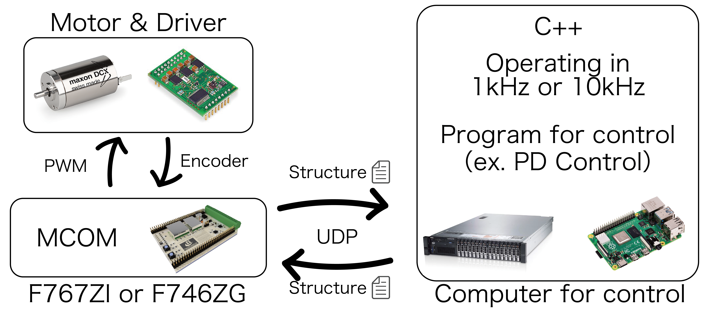

# Getting Started with Motor Control on Mbed

**MCOM (Motor Control on Mbed)** is a C++ library designed for Mbed, enabling high-speed and high-resolution control through communication between an Mbed device and a PC.  
With MCOM, you can easily create sophisticated control systems without large-scale hardware setups.

---

## Get ready

- NUCLEO-F767ZI/F746ZG
- Linux, Mac, or Windows PC
- Reliable LAN cable
- NIC (Network Interface Card)

---

## How to use

### Overview

The Mbed with MCOM acts as a bridge between the control PC and the motor system.  
The Mbed can issue PWM commands directly to the motor.  
Control operations are performed from the PC, enabling easier development and more sophisticated control and computations.

---

### Library

To implement your own control using this library, modify these files accordingly:

1. **main.cpp**: Program-wide declarations and periodic settings (typically no changes needed).
2. **config.h**: Declarations of variables and classes (add your own as required).
3. **function.h**: The actual control logic (write your specific control algorithms here).
4. **dataStruct.h**: Structures for sending and receiving data via UDP (modify as needed).

---

## Acknowledgment

This library is the crystallization of collective knowledge. Special thanks go to [Kota Kobayashi](https://github.com/orgs/crl-tdu/people/CRL-Kobayashi) and [Yutaka Inoue](https://github.com/ji1xcn).

---

## Principal

Socket communications have buffers. If data arrives faster than the UDP reception cycle, performing only one UDP reception per control loop will only read the oldest data from the buffer. To completely clear the buffer and retrieve the most recent data (with minimal delay), you must perform multiple UDP receptions within one control loop.

From the perspective of real-time control, it is meaningful to send UDP data at intervals faster than the UDP receiving interval. UDP is a “fire-and-forget” protocol, meaning packets can occasionally get lost or fail to arrive. If the UDP sending and receiving cycles were identical and a packet failed to arrive, you'd be without updated data until the next cycle, compromising stable control. Using the method described—multiple UDP receptions within a control loop—ensures you always get the latest, most reliable data.

Note that this method isn't standard practice. It may not apply to every UDP scenario and can also place additional load on your CPU, potentially impacting your control system’s performance. Thus, consider this method primarily as an advanced solution to minimize latency and ensure real-time data integrity.