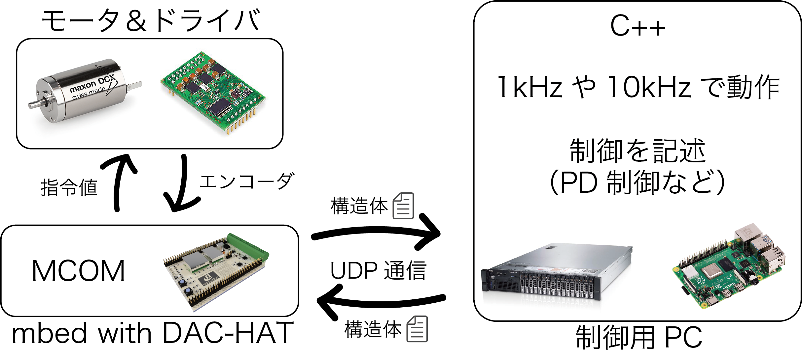

# Motor Control on Mbedをはじめよう

MCOM（Motor Control on Mbed）はmbedとPC間で通信し、高速で高精細な制御を可能にするmbed用C++ライブラリです。
MCOMを使用すれば、大掛かりな装置を用意することなく、制御システムを構築できます。

## Get ready

- NUCLEO-F767ZI/F746ZG
- Linux or Mac or Windows
- Reliable LAN cable
- NIC (Network Interface Card)

## How to use

### Overview

MCOMが書き込まれたmbedは制御用PCとモータシステムの橋渡しを担います。
mbedからPWMでモータへ指令することができます。
また、制御をPCベースで行うことで、作業がしやすく、複雑な制御や重い計算も行うことができます。

### Library

本ライブラリでなにか制御を実現したいとき、

1. main.cpp : プログラム全体の宣言や周期の設定（いじらなくても良い）
2. config.h : 変数やクラスの宣言（追加する場合は個々に記述）
3. function.h : 制御の中身（制御の動作はここに記述）
4. dataStruct.h : 送受信に使用する構造体（送受信データの変更はここ）

の内容を変更します。

## Acknowledgment

本ライブラリは叡智of叡智の結晶です。[小林航大氏](https://github.com/orgs/crl-tdu/people/CRL-Kobayashi)と[井上温氏](https://github.com/ji1xcn)に感謝の意を評します。

## Principal

ソケット通信にはバッファが存在します。UDPの受信周期以上に送信されたデータがある場合、UDPの受信を一回行うだけでは、バッファの先頭しか読み取ることができません。そこで、UDPの受信を一家の制御ループ内で何回も行うことで、バッファを全て読み切ります。最後に読み取ったデータが最新のデータであり、遅れが最も少ないデータとなります。

以上の処理工程を考えた際に、UDPを受信周期以上に送信することの意義は、リアルタイム性にあります。UDPは”送りっぱなし”のソケット通信方式であるため、データが欠損したり届かなかったりすることがあります。もし、UDPの送信と受信が同周期の場合で、データの送信に不備があった際には、少なくとも次の周期までデータは届かず、安定した制御が担保されません。そこで、上記の方法で送受信を行うことで、確実で最新なデータを取得することができます。

この方法はあまり一般的ではありません。なので、この方法が全てのUDP送受信に当てはまらないことを念頭に置いてください。また、この方法はCPUに一定の負荷を与え、制御プログラムの実行に影響を与えることさえあります。したがって、この方法はあくまで、UDPの送受信で遅延なくデータを送受信するためにはどうするか、を解決するパワー攻略方法なのです。